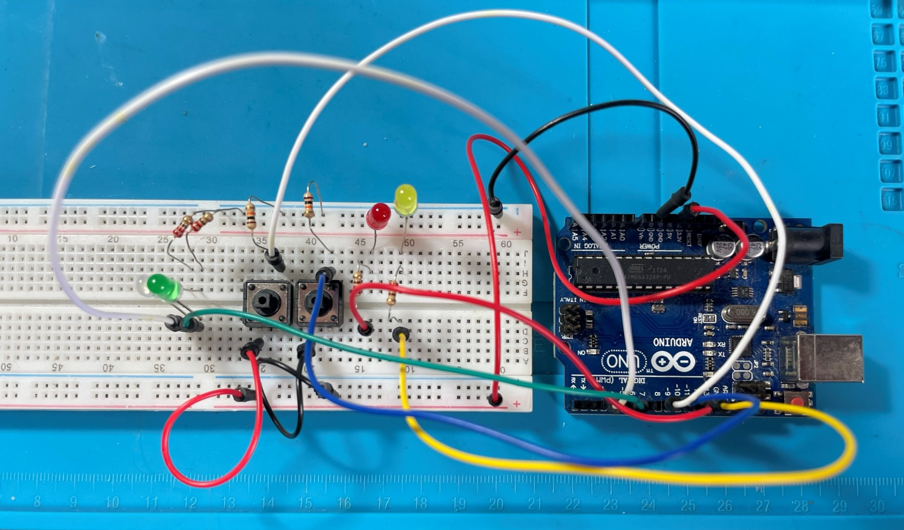
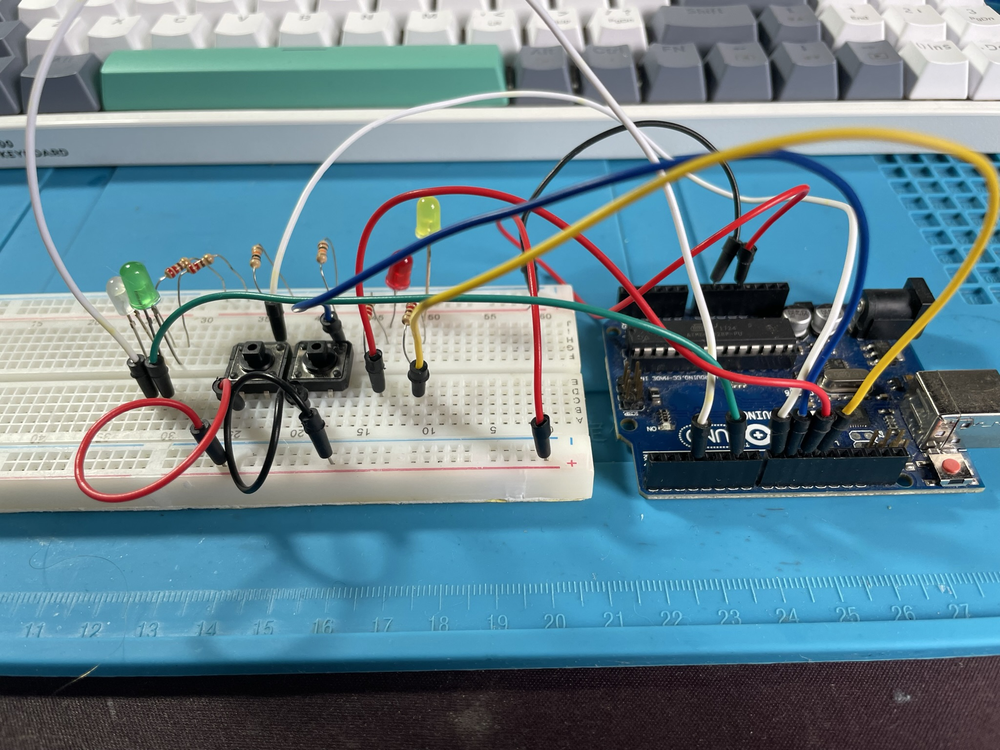

  
  

## 🖥️ Projeto

Esse é um projeto para controlar leds com arduino e push button.

## 🚀 Tecnologias

Esse projeto foi desenvolvido durante exercicios do livro "Como desenvolver soluções de automação e IOT com Node.js e JavaScript para Arduino e Esp's 32" de DANIEL MADEIRA BUENO.

- C++ (Arduino)
- Github

